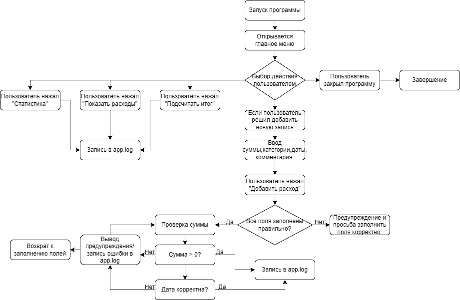

# student-expense-tracker
Учебное приложение на Python для учёта и анализа личных расходов студента
# Система учёта личных расходов студента

## Описание проекта
Данное приложение разработано на языке Python с использованием библиотеки Tkinter.  
Программа предназначена для учёта и контроля личных расходов студента.

Приложение позволяет вводить данные о расходах, проверять их корректность, сохранять в файл и просматривать в удобном виде.

---

## Функциональные возможности
Программа реализует следующие функции:

- ввод данных о расходах (сумма, категория, дата, комментарий);
- автоматическое форматирование даты (ДД.ММ.ГГГГ);
- проверка корректности введённых данных;
- ограничение ввода некорректных символов;
- сохранение данных в файл JSON;
- просмотр списка расходов;
- удаление записей;
- подсчёт общей суммы расходов;
- отображение статистики по категориям;
- ведение логирования действий пользователя.

---

## Особенности реализации

### Проверка данных
- сумма должна быть положительным числом;
- дата вводится только цифрами и автоматически форматируется;
- дата не может быть раньше 01.01.2000;
- дата не может быть позже текущей даты.

### Логирование
Все действия пользователя записываются в файл `app.log`, включая:
- запуск программы;
- добавление и удаление расходов;
- ошибки ввода;
- автоматическую проверку данных.

### Автоматизация
В программе реализована автоматическая проверка данных через определённый интервал времени.

---

## Используемые технологии
- Python
- Tkinter (графический интерфейс)
- JSON (хранение данных)
- logging (логирование)

---
## Интерфейс программы

## Use Case диаграмма

Use Case диаграмма отражает основные действия пользователя в программе.

Актор системы:
- Пользователь

Пользователь может выполнять следующие действия:
- добавить расход;
- просмотреть расходы;
- удалить запись;
- подсчитать итог;
- посмотреть статистику.

Данная диаграмма показывает взаимодействие пользователя с основными функциями программы и позволяет наглядно представить сценарии её использования.

---

## Блок-схема программы

Блок-схема демонстрирует алгоритм работы программы и последовательность выполнения основных действий.

Основные этапы работы программы:
- запуск программы;
- открытие главного окна;
- выбор действия пользователем;
- ввод данных о расходе;
- проверка корректности введённых данных;
- сохранение данных;
- вывод сообщений об ошибках или успешном результате;
- запись действий пользователя в файл логирования;
- завершение работы программы.

Блок-схема позволяет наглядно отобразить логику работы программы, включая проверки условий и переходы между различными этапами обработки данных.

